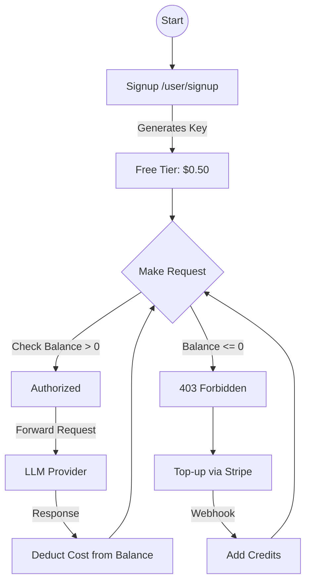
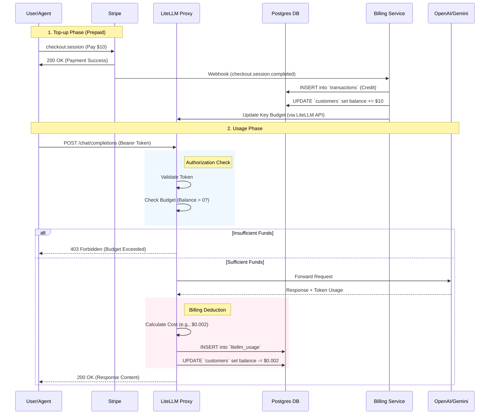

# Stripe Billing Integration Guide

This document explains the end-to-end billing lifecycle for the LiteLLM Proxy, from initial signup to payment and usage enforcement.

## 🔄 User Journey Overview

The system uses a **Prepaid Credit Model**. Users must have a positive balance to make API calls.

## 📐 Detailed Sequence Diagram

This diagram shows the exact API calls and database interactions.

---

## 1. 🆕 Signup & Free Tier

**Endpoint**: `POST /user/signup`

When a new user signs up, the system automatically provisions an API key with a small "Free Tier" budget to allow immediate onboarding without a credit card.

*   **Request**: `{ "email": "user@example.com" }`
*   **System Actions**:
    1.  Creates a record in the `customers` table.
    2.  Generates a LiteLLM API Key.
    3.  Sets the initial `max_budget` to **$0.50**.
*   **Result**: User receives an `api_key` and can start making requests immediately.

## 2. 💳 Adding Funds (Top-up)

Once the free tier is exhausted, the user must purchase credits.

**Workflow**:
1.  **Checkout**: User visits a Stripe Payment Link (handled by your frontend/dashboard) to pay (e.g., $10).
2.  **Webhook Processing**:
    *   Stripe sends a `checkout.session.completed` event to `/webhook/stripe`.
    *   The billing service validates the signature.
    *   **Database Update**:
        *   `transactions` table: Logs the credit +$10.00.
        *   `customers` table: Updates `balance_usd += 10.00`.
    *   **Key Update**: Calls LiteLLM to increase the user's `max_budget` by the paid amount.

## 3. 📉 Usage & Deduction

Every API call triggers a real-time balance check and deduction.

**Sequence**:
1.  **Authorization**:
    *   Proxy receives request `POST /v1/chat/completions`.
    *   **Check**: Is `customers.balance_usd > 0`?
    *   *If No*: Request is rejected immediately (`403 Forbidden`).
2.  **Execution**: Request is forwarded to OpenAI/Gemini.
3.  **Billing**:
    *   Response is received (e.g., Cost: $0.002).
    *   **Atomic Transaction**:
        *   `UPDATE customers SET balance_usd = balance_usd - 0.002`.
        *   `INSERT INTO transactions (type='debit_usage', ...)`

## 4. 🚫 Service Suspension

Service is suspended automatically when the balance hits zero.

*   **Trigger**: `balance_usd <= 0.00`.
*   **User Experience**: API returns `403 Forbidden - Insufficient Funds`.
*   **Resolution**: User must complete the **Top-up** flow to restore service.

## 🛠 Technical Schemas

### Database Tables
*   **`customers`**: Stores `tenant_id` (email), `stripe_customer_id`, and `balance_usd`.
*   **`transactions`**: Immutable ledger of every credit (payment) and debit (usage).

### API Endpoints
*   `POST /user/signup`: Create account/key.
*   `POST /webhook/stripe`: Receive payment notifications.

---

## ⚙️ Configuration & Secrets

For a production environment, you must securely manage keys. We follow **Best Practices** by injecting secrets at runtime.

### 1. Secret Manager (CI/CD)
Do **NOT** hardcode keys. Store them in Google Secret Manager or GitHub Secrets. Your deployment script (`deploy_cloud_run_enhanced.sh`) is already configured to pull these:

*   `STRIPE_API_KEY`: Secret Key from Stripe Dashboard (`sk_live_...`).
*   `STRIPE_WEBHOOK_SECRET`: Signing secret from the Webhooks page (`whsec_...`).
*   `PROXY_MASTER_KEY`: Admin key for LiteLLM.

### 2. Stripe Dashboard Setup

#### A. Create the Product (Prepaid Credits)
Go to **Products** > **Add Product** and fill in exactly as follows:
*   **Name**: `API Credits` (or "Standard Top-up")
*   **Description**: `Prepaid credits for LLM API usage.`
*   **Image**: (Optional, but looks good on checkout)
*   **Pricing Model**: `Standard pricing`
*   **Price**: `$10.00` (or your desired amount)
*   **Currency**: `USD`
*   **Billing period**: **One-time** (Critical: Do NOT select Recurring)
*   **Unit label**: `credit pack` (This makes receipts say "1 credit pack" instead of just "1")
*   **Marketing feature list** (visible on pricing table):
    *   `Access to GPT-4o & Gemini 1.5`
    *   `No monthly fees`
    *   `Credits never expire`
    *   `Priority Support`

Once created:
1.  Click on the the product.
2.  Look for the **Payment Link** button or copy the **Price ID** (`price_...`) if building a custom frontend.

#### B. Configure Webhooks
    *   Go to **Developers** > **Webhooks**.
    *   Endpoint URL: `https://YOUR_CLOUD_RUN_URL/webhook/stripe`
    *   Select Event: `checkout.session.completed`
    *   *Result*: You will get a Signing Secret (`whsec_...`).

---

### 3. Tax Configuration (Singapore GST)

**GST Rate**: **9%** (as of 2024/2025).

*   **Mandatory**: If your annual taxable revenue is **> $1M SGD**.
*   **Startup Exemption**: If you earn **< $1M SGD**, you do **NOT** need to register or collect GST.
    *   *Advice*: Don't register voluntarily unless you have high expenses to claim refunds on, as it adds compliance costs (`GST F5` filing).

If you **are** registered:
1.  **Enable Stripe Tax**: Go to **Settings** > **Tax**.
2.  **Add Registration**: Add your Singapore GST registration details.
3.  **Update Payment Link**: In your Payment Link settings, check "Collect tax automatically". Stripe will detect the user's location and add the 9% on top of your $10 price.

---

## 💡 Strategic Advice

### Is this Best Practice?
Yes. The **Prepaid Model** is the industry standard for API proxies (like OpenRouter, Together AI).
*   **Safety**: It isolates you from "runaway bill" attacks. If a user's key is leaked, they can only drain their prepaid balance, not your entire bank account.
*   **Architecture**: Using a ledger table (`transactions`) alongside a balance cache is an audit-proof implementation.

### Pricing & Markup Strategy
You need to cover **Stripe Fees** (~2.9% + 30¢) and **Platform Overhead**.

**Recommended Markup**: **1.5x to 2x** base cost.

#### Cost Analysis (Gemini 1.5 Flash)
*   **Your Cost**: ~$0.075 / 1M tokens (Input).
*   **Suggested Price**: $0.15 / 1M tokens.
    *   *Why?* To cover the "Free Tier" losses and operational costs (Cloud Run, SQL).
    *   *Competitive Edge*: This is still cheaper than GPT-4o mini (~$0.15/1M).

#### Computational Resources
*   **Memory**: LiteLLM is lightweight. `1GiB` is sufficient for up to ~50 concurrent requests.
*   **CPU**: 1 vCPU is standard.
*   **Scaling**: Cloud Run handles this automatically. If you hit 1000s of users, increase `max_instances`.

