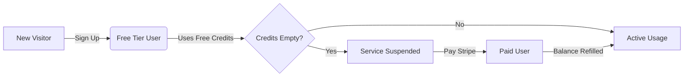
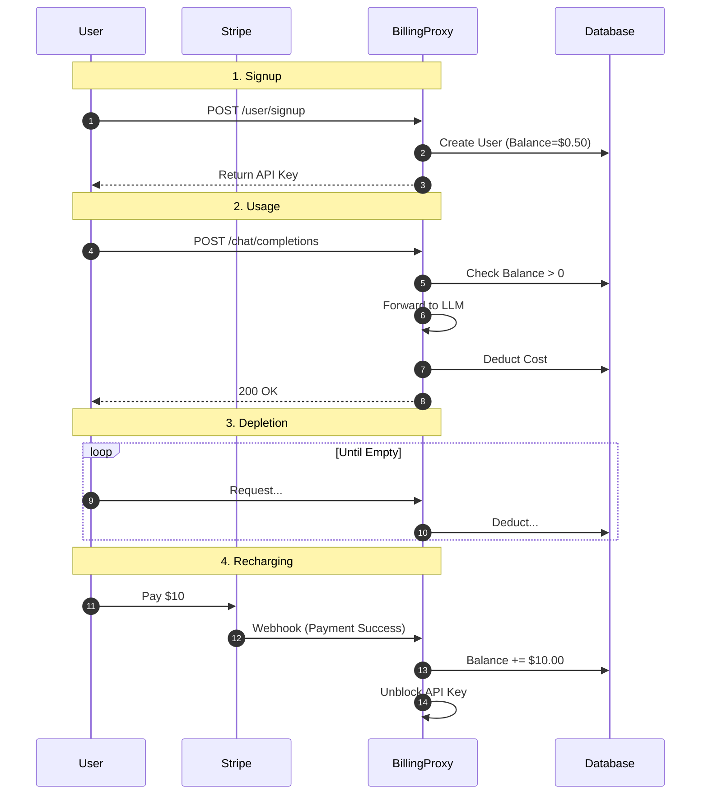

# User Journey: Billing & Usage

This document outlines the complete lifecycle of a user interacting with the BillingProxy service, from their first signup to regular usage and payment refills.

## 🌟 High-Level Visual Flow

---

## 🚀 Phase 1: Onboarding (Free Tier)

**Goal**: Get the user using the API as quickly as possible without friction.

1.  **Action**: User sends a request to create an account.
    *   `POST /user/signup`
    *   Payload: `{ "email": "alice@example.com" }`
2.  **System Response**:
    *   Provisions a new API Key.
    *   Grants **$0.50** in free credits.
    *   Returns the key: `sk-litellm-xxxx`.
3.  **User State**: Active (Free Tier).

## 🏢 Phase 2: Active Usage

**Goal**: User integrates the API key into their application.

1.  **Action**: User sends an LLM request.
    *   `POST /v1/chat/completions`
    *   Header: `Authorization: Bearer sk-litellm-xxxx`
2.  **System Check**:
    *   Is `balance > 0`? ✅ Yes.
3.  **Result**:
    *   Request processed by Gemini/OpenAI.
    *   Cost (e.g., $0.001) is calculated.
    *   Balance deducted immediately (e.g., $0.50 -> $0.499).

## ⚠️ Phase 3: Depletion & Suspension

**Goal**: Prevent usage when funds run out.

1.  **Trigger**: User's balance hits **$0.00**.
2.  **Action**: User sends another request.
3.  **System Response**:
    *   `403 Forbidden`
    *   Message: "Insufficient funds. Please top up."
4.  **User State**: Suspended.

## 💳 Phase 4: Top-Up (Stripe Payment)

**Goal**: User pays to restore service.

1.  **Action**: User follows the "Top Up" link to Stripe Checkout.
2.  **Payment**: User pays **$10.00** via Credit Card.
3.  **System Action (Background)**:
    *   Stripe webhook notifies the Proxy.
    *   Proxy updates the user's ledger: `+$10.00`.
    *   Proxy updates the API Key budget limit.
4.  **Result**: Service is automatically restored.
5.  **User State**: Active (Paid).

---

## 🔍 Detailed Interaction Diagram

